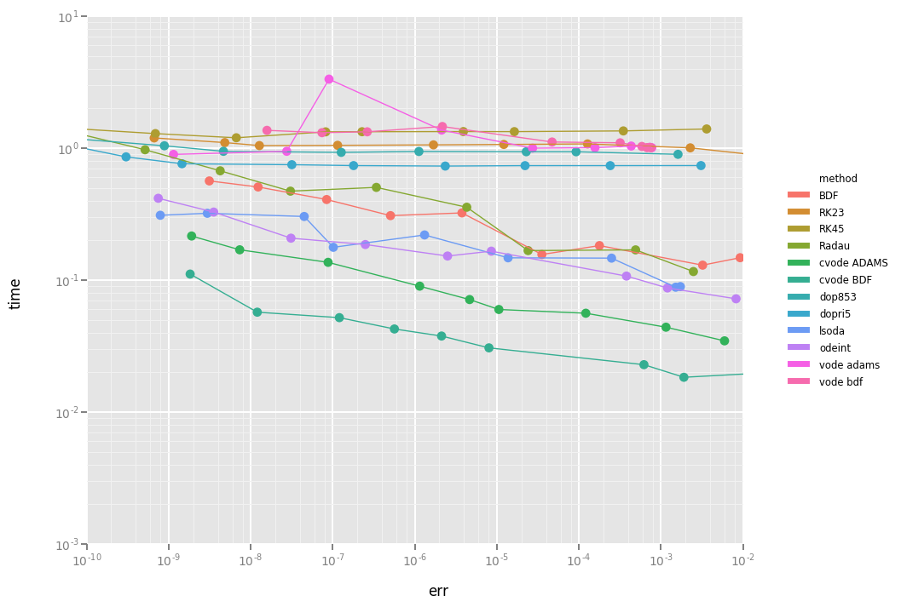

.. _choosing_solvers:

Choosing a Solver
#################
``odes`` interfaces with a number of different solvers:

`CVODE <https://computation.llnl.gov/projects/sundials/cvode>`_
    ODE solver with BDF linear multistep method for stiff problems and Adams-Moulton linear multistep method for nonstiff problems. Supports modern features such as: root (event) finding, error control, and (Krylov-)preconditioning. See :py:mod:`scikits.odes.sundials.cvode` for more details and solver specific arguments. Part of SUNDIALS, it is a replacement for the earlier ``vode``/``dvode``.

`IDA <https://computation.llnl.gov/projects/sundials/ida>`_
    DAE solver with BDF linear multistep method for stiff problems and Adams-Moulton linear multistep method for nonstiff problems. Supports modern features such as: root (event) finding, error control, and (Krylov-)preconditioning. See :py:mod:`scikits.odes.sundials.ida` for more details and solver specific arguments. Part of SUNDIALS.

`dopri5 <https://docs.scipy.org/doc/scipy/reference/generated/scipy.integrate.ode.html>`_
    Part of :py:mod:`scipy.integrate`, explicit Runge-Kutta method of order (4)5 with stepsize control.

`dop853 <https://docs.scipy.org/doc/scipy/reference/generated/scipy.integrate.ode.html>`_
    Part of :py:mod:`scipy.integrate`, explicit Runge-Kutta method of order 8(5,3) with stepsize control.

``odes`` also includes for comparison reasons the historical solvers:

`lsodi <http://www.netlib.org/odepack/opkd-sum>`_
    Part of `odepack <http://www.netlib.org/odepack/opkd-sum>`_, IDA should be
    used instead of this. See :py:mod:`scikits.odes.lsodiint` for more details.

`ddaspk <http://www.netlib.org/ode/>`_
    Part of `daspk <http://www.netlib.org/ode/>`_, IDA should be used instead of this. See :py:mod:`scikits.odes.ddaspkint` for more details.

Support for other SUNDIALS solvers (e.g. ARKODE) is currently not implemented,
nor is support for non-serial methods (e.g. MPI, OpenMP). Contributions adding
support new SUNDIALS solvers or features is welcome.

Performance of the Solvers
==========================

A comparison of different methods is given in following image. In this BDF, RK23, RK45 and Radau are `python implementations <https://github.com/scipy/scipy/pull/6326>`_; cvode is the CVODE interface included in ``odes``; lsoda, odeint and vode are the `scipy integrators (2016) <https://docs.scipy.org/doc/scipy/reference/generated/scipy.integrate.ode.html>`_, dopri5 and dop853 are the Runge-Kutta methods in `scipy <https://docs.scipy.org/doc/scipy/reference/generated/scipy.integrate.ode.html>`_. For this problem, cvode performs fastest at a preset tolerance.

You can generate above graph via the `Performance notebook <https://github.com/bmcage/odes/blob/master/ipython_examples/Performance%20tests.ipynb>`_.

Solver Specific Options
#######################

The high level interfaces allow the option of passing solver specific options to
the solvers. These options are covered in more detail in the `API docs <https://bmcage.github.io/odes>`_, but some features specific to ``odes`` are mentioned below.

SUNDIALS
========

There are a number of SUNDIALS specific utilities in :py:mod:`scikits.odes.sundials`.
Firstly there are :py:func:`scikits.odes.sundials.ontstop_stop`, :py:func:`scikits.odes.sundials.ontstop_continue`, :py:func:`scikits.odes.sundials.onroot_stop` and :py:func:`scikits.odes.sundials.onroot_continue`, which can be used with the `ontstop` or `onroot` options to either stop or continue evaluation when tstop or a root is encountered.
Secondly, there are functions which can be passed to the `err_handler` option to either stop all messages from SUNDIALS being printed (:py:func:`scikits.odes.sundials.drop_all_error_handler`), or to pass them to Python's logging machinery (:py:func:`scikits.odes.sundials.log_error_handler`).
Finally, the module contains the exceptions which can be caught in user code raised when using the `validate_flags` option.
